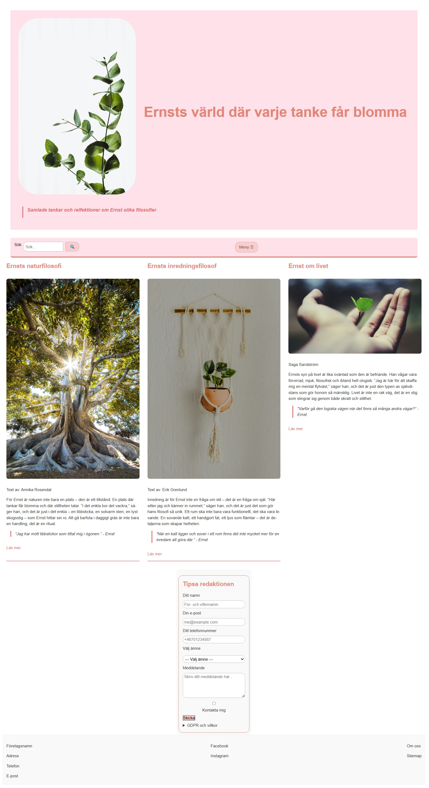

# Inlämningsuppgift 2
## Storypoints - skala 

`0,5 · 1 · 2 · 3 · 5 · 8`

- **0,5 SP**: mycket litet (t.ex. justera sidtitel)
- **1 SP**: litet, går snabbt (t.ex. lägga till en sektion eller en bild med korrekt attribut)
- **2–3 SP**: medel, moment som kräver mer noggrannhet (t.ex. bygga en artikel med figur och blockcitat)
- **5–8 SP**: större  moment som behöver testas och justeras flera gånger (t.ex. första fulla strukturen, större omtag efter validering)

## Tidsuppskattning

- Kopiera HTML från uppgift 1 och koppla CSS samt testa om det fungerade - [ 1 SP ] 
- Planera och tänka igenom struktur och flöde [ 2 SP ]
- Grundläggande CSS [ 3 SP ]
- Header och meny med Flex [ 3 SP ]
- Innehållssektioner grid+ flex [ 5 SP ]
- Footer med kontaktinfo/länkar [ 2 SP ]
- Kontrollera responsivitet  [ 5 SP ]
- Finjustera och granska [ 4 SP]
- Tillgänglighetsgranska koden [ 3 SP ]
- W3C-validering HTML och CSS [ 2 SP ]
- README med tidslogg och reflektion [ 1,5 SP]

| Uppgift                               | Story Points (SP) |
|-------------------------------------|-------------------|
| Kopiera HTML från uppgift 1 och koppla CSS   | 1 SP              |
| Planera och tänka igenom struktur och flöde   | 2 SP              |
| Grundläggande CSS                   | 3 SP              |
| Header och meny med Flex           | 3 SP              |
| Innehållssektioner med Grid/Flex   | 5 SP              |
| Footer med kontaktinfo/länkar      | 2 SP              |
| Kontrollera responsivitet          | 5 SP              |
| Finjustera och granska             | 4 SP              |
| Tillgänglighetsgranska koden       | 3 SP              |
| W3C-validering HTML och CSS        | 2 SP              |
| README med tidslogg och reflektion | 1,5 SP            |
|                                                       |

## Resultat av estimat  
| Uppgift                            | Estimat | Utfall |
|-----------------------------------|---------|--------|
| Kopiera HTML från uppgift 1 och koppla CSS | 1 SP | 1 SP |
| Planera och tänka igenom struktur och flöde | 2 SP | 3 SP |
| Grundläggande CSS                  | 3 SP    | 5 SP |
| Header och meny med Flex           | 3 SP    | 6 SP |
| Innehållssektioner med Grid/Flex   | 5 SP    | 7 SP |
| Footer med kontaktinfo/länkar      | 2 SP    | 6 SP |
| Kontrollera responsivitet          | 5 SP    | 7 SP |
| Finjustera och granska             | 4 SP    | 5 SP |
| Tillgänglighetsgranska koden       | 3 SP    | 7 SP |
| W3C-validering HTML och CSS        | 2 SP    | 3 SP |
| README med tidslogg och reflektion | 1,5 SP  | 2 SP |
|                                                       |

## Sammanfattning  

### Vad jag har lärt mig:
- Responsiv design kräver mycket testande och tålamod. Jag har fått en djupare förståelse för de utmaningar som finns i att skapa en fungerande och responsiv webbplats från grunden. 

- Vikten av planering i HTML/CSS för justering av layout senare.

- Små detaljer i CSS kan ha stora konsekvenser för helheten

### Att arbeta vidare på:
- Göra fler, mindre och tydligare commits.

- Öva mer på att implementera menyer och formulär på ett mer effektivt och responsivt sätt.

- Arbeta vidare med tillgänglighet och tester

### Responsivitet & tillgänglighet:
Särskilt mycket tid har gått åt till att få artiklarna att fungera smidigt i både mobil- och desktopvy. Placering av "Tipsa redaktionen" under artiklarna och att få hamburgemenyn och sökfältet att fungera optimalt har också varit utmanande moment jag fastnat länge i. Här har jag lärt mig att små detaljer gör stor skillnad för användarupplevelen.

### AI:
Ai har varit värdefullt för ideér och felsökning samt att det med ai har det varit möjligt att utforska olika strukturer men också att förstå konsekvener av att flytta element. När jag har testat felsökning med olika AI-verktyg har jag fått olika förslag och lösningar, som ibland bara gjort saker i koden sämre och jag har behövt analysera och teta mycket själv.

### Resultat:

